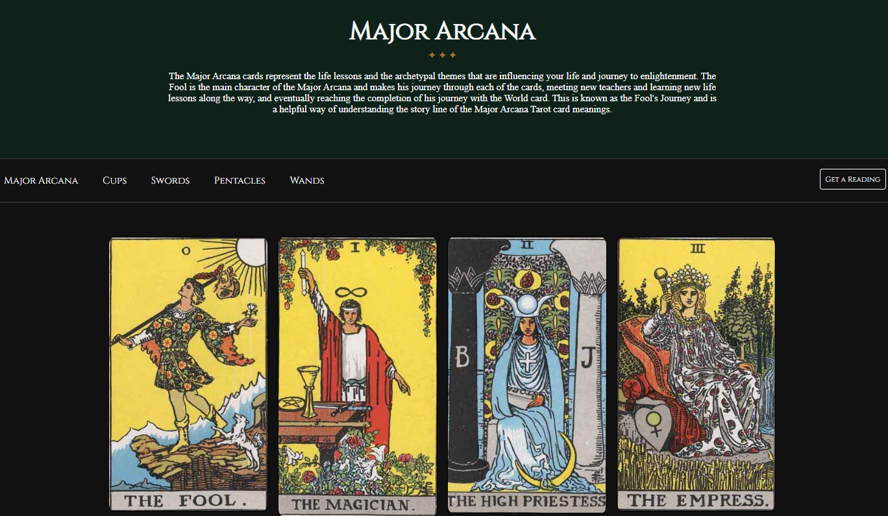
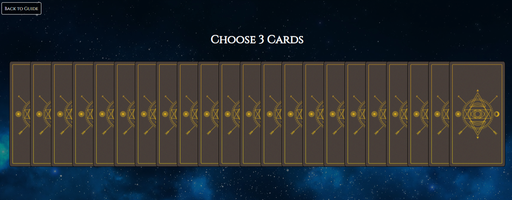

# Tarot Guide

[Link to Site](https://carring10.github.io/tarot-guide/index.html)

## Introduction

This web application provides a comprehensive guide to reading tarot cards, along with a feature that generates random tarot readings. Built with JavaScript, HTML, and CSS, this application is designed to be user-friendly and accessible to both beginners and experienced tarot readers.

With this guide, you can learn about tarot card meanings, explore different tarot spreads, and get insightful interpretations of your readings. The random reading generator feature allows you to generate a reading on the spot, providing you with guidance and inspiration whenever you need it.

Whether you're a seasoned tarot reader or just starting out, this guide is the perfect tool to enhance your tarot reading skills and gain deeper insights into the mystical world of tarot.

## Visuals

